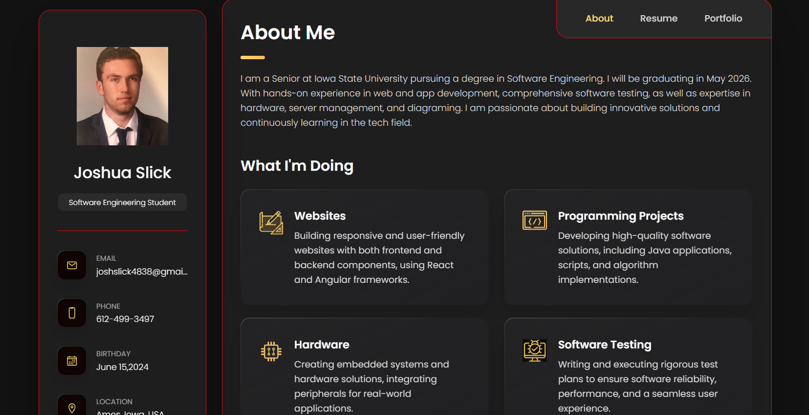

# Joshua Slick – Personal Portfolio Website

This is a responsive **vCard-style portfolio website** built with HTML, CSS, and JavaScript. It showcases my background, skills, projects, and work experience as a Software Engineering student at Iowa State University.

## 🌐 Live Site

[Visit the Portfolio](josh-software-engineer-website.netlify.app)  


---

## 📁 Features

- **Responsive layout** for mobile and desktop
- Interactive sidebar with:
  - Profile, email, and contact links
  - Social media icons (GitHub, LinkedIn, Instagram)
- **About Me** section with a short biography
- **What I’m Doing** section highlighting:
  - Web development
  - Hardware & embedded systems
  - Software testing
  - Programming projects
- **Resume** with education and work experience
- **Skills** including languages, tools, and hardware experience
- **Portfolio** showcasing live projects and GitHub repositories

---

## 🛠 Tech Stack

- **HTML5**
- **CSS3**
- **JavaScript**
- **Ionicons** for icons
- **Google Fonts** (Poppins)
- **Netlify** for hosting

---

## 📸 Screenshots


```md

